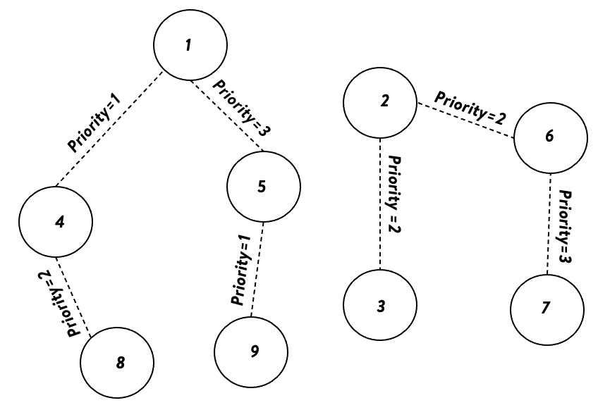
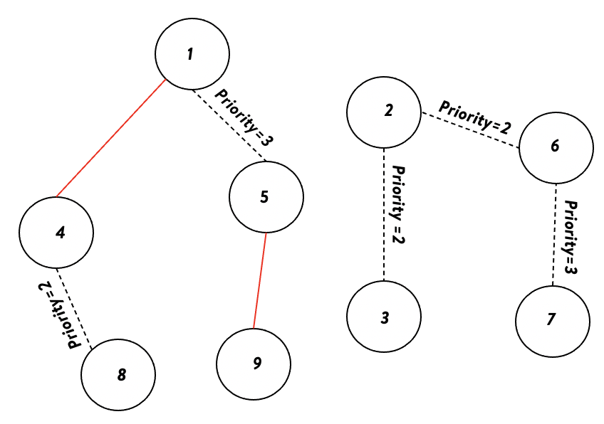
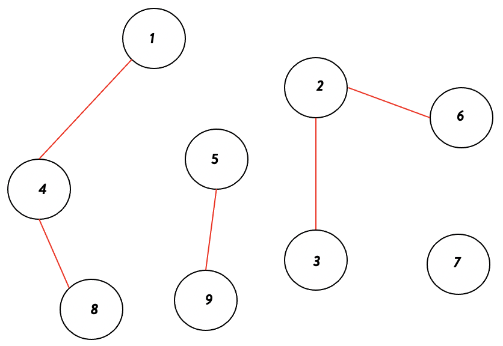

# Priority Based Connected Components
In many scenarios we see there is a need to run connected components but first connect entities with higher priority edges and then move to lower priority ones. Also apart from it, every group has a size-limit.
To tackle such analytical challenges we have come up with an algorithm to adjust the priority of edges and limit the size of the components.

## How to use it?
Copy priorityx.py to your working directory

```
from priorityY import priority_based_linkage
G = [(1,4,1),(1,5,3),(2,3,2),(2,6,2),(6,7,3),(4,8,2),(5,9,1)]
threshold = 3
components = priority_based_linkage(G,threshold)
print(components)
```

The method priority_based_linkage takes a Graph as input and does priority based linkage.
G to be in the form [(u,v,p),..] denoting list of tuples (node1, node2 and priority)
where priority needs to be a consecutive number(1,2,3 and so on)
and lower the value higher the priority i.e. Priority(1>2>3 and so on)

visit_order is an optional parameter providing users an option to input the visit ordering of nodes.
Input format [u1,u2,u3...un], list of nodes, u1 will be visited before u2 and u2 before u3 and so on.
If the user doesn't provide any ordering, the nodes will be visited in any order.

## Output
```
[[1, 4, 8], [2, 3, 6], [5, 9], [7]]
```
Let us visualise the above example for better understanding how the library works.
The threshold is set to 3, limiting the size of components. Dotted edges denote the link and priority associated.




At the first iteration, all nodes having edges with Priority-1 get connected.


1–4 and 5–9 gets connected.

In the next iteration, the algorithm connects nodes with edges between them of Priority-2.




1–4–8 gets connected, 2–3–6 gets connected and both reach the threshold


The algorithm stops as the threshold is reached for components and no more edges left. Above are the final connected components with the set threshold and provided edges priority.
